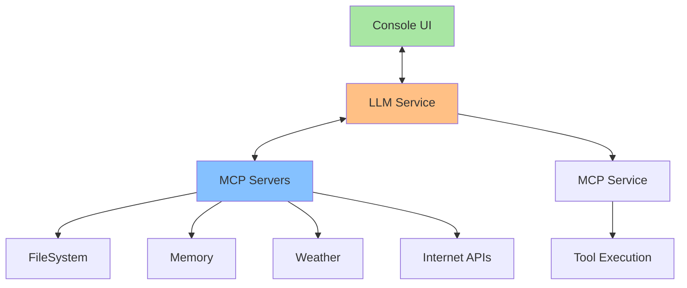

# 🇺🇸 MCP Client in Java

[](https://www.oracle.com/java/)
[](https://modelcontextprotocol.io/)
[](https://maven.apache.org/)

This repository demonstrates how to create Java applications with **Agent Client** capabilities using the **MCP (Model Context Protocol)** protocol. The project includes practical examples of integration with different LLMs and strategies for automatic tool selection.

## 📋 Table of Contents

- [What is MCP?](#what-is-mcp)
- [Included Projects](#included-projects)
- [Architecture](#architecture)
- [Prerequisites](#prerequisites)
- [Installation](#installation)
- [Configuration](#configuration)
- [Usage](#usage)
- [Tool Selection Strategies](#tool-selection-strategies)
- [Security](#security)
- [External Resources](#external-resources)

## 🤖 What is MCP?

The **Model Context Protocol (MCP)** is a protocol that defines a standard for connecting language models to contexts and tools. 

## 📦 Included Projects

### 1. AiChat

**Description:** Simple client for Google Gemini interaction  
**Features:**

- Direct integration with Gemini API
- Interactive console interface

### 2. ChatMCPGemini4J

**Description:** Complete MCP client integrated with Gemini  
**Features:**

- Multiple MCP servers support
- Automatic tool selection
- Function calling with Gemini

### 3. ChatMCPGroq4J ⭐

**Description:** Advanced MCP client with Groq LLM  
**Features:**

- Groq integration 
- workflow: Query → Tool Selection → MCP Execution
- Multiple tool chaining

### 4. MCPClient

**Description:** Basic MCP client for demonstration  
**Features:**

- Simple example using Java MCP SDK
- Filesystem server connection
- Basic file operation

## 🏗️ Architecture



## 🔧 Prerequisites

- **Java 17+**
- **Maven 3.6+**
- **Node.js** (for MCP servers)
- **API Keys:**
  - Groq API Key (recommended)
  - Google Gemini API Key

## 📥 Installation

1. **Clone the repository:**
   
   ```bash
   git clone https://github.com/gazolla/JavaMCPClient
   cd WRKGRPMCP
   ```

2. **Install Maven dependencies:**
   
   ```bash
   mvn clean install
   ```

3. **Install MCP servers:**
   
   ```bash
   # Filesystem server
   npm install -g @modelcontextprotocol/server-filesystem
   npm install -g @modelcontextprotocol/server-weather
   ```

## ⚙️ Configuration

### 1. Environment Variables

Set up the following environment variables:

```bash
# For Groq
export GROQ_API_KEY=<groq api key>

# For Gemini
export GEMINI_API_KEY=<api key here>
```

### 2. MCP Server Configuration

Projects are configured to automatically connect to available MCP servers. Servers are discovered and initialized dynamically.

## 🚀 Usage

### ChatMCPGroq4J (Recommended)

```bash
cd ChatMCPGroq4J
mvn clean compile exec:java
```

**Example commands:**

- `"List files in Documents folder"`
- `"What's the weather forecast for today?"`
- `"Save weather information to a file"`
- `"Read the file I just created"`

## 🌐 External Resources

- **[Groq.com](https://groq.com/)** - Fast LLM for inference
- **[MCP Servers](https://mcpservers.org)** - MCP server catalog
- **[Java MCP SDK](https://github.com/modelcontextprotocol/java-sdk)** - Official Anthropic SDK

## 🤝 Contributing

1. Fork the project
2. Create your feature branch (`git checkout -b feature/AmazingFeature`)
3. Commit your changes (`git commit -m 'Add some AmazingFeature'`)
4. Push to the branch (`git push origin feature/AmazingFeature`)
5. Open a Pull Request

## 📝 License

This project is under the MIT License. See the `LICENSE` file for details.


