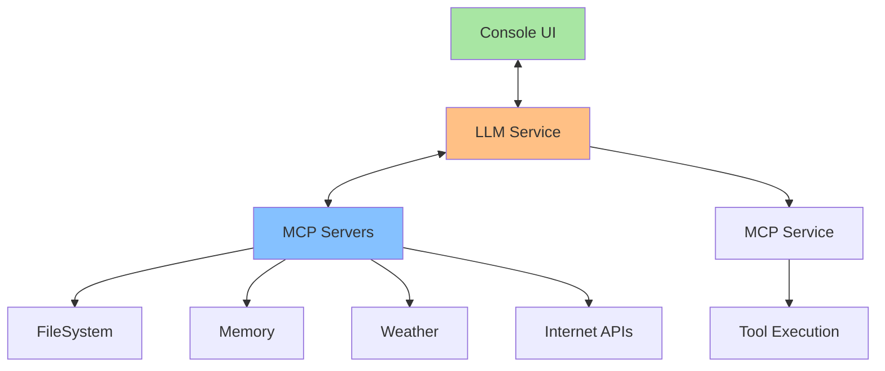

# 🇧🇷 Cliente MCP em Java

[](https://www.oracle.com/java/)
[](https://modelcontextprotocol.io/)
[](https://maven.apache.org/)

Este repositório demonstra como criar aplicações Java com capacidades de **Cliente Agente** usando o protocolo **MCP (Model Context Protocol)**. O projeto inclui exemplos práticos de integração com diferentes LLMs e estratégias para seleção automática de ferramentas.

## 📋 Índice

- [O que é MCP?](#o-que-é-mcp)
- [Projetos Incluídos](#projetos-incluídos)
- [Arquitetura](#arquitetura)
- [Pré-requisitos](#pré-requisitos)
- [Instalação](#instalação)
- [Configuração](#configuração)
- [Uso](#uso)
- [Recursos Externos](#recursos-externos)

## 🤖 O que é MCP?

O **Model Context Protocol (MCP)** é um protocolo que define um padrão de conexão de modelos de linguagem a contextos e ferramentas.

## 📦 Projetos Incluídos

### 1. AiChat

**Descrição:** Cliente simples para interação com Google Gemini  
**Características:**

- Integração direta com API Gemini
- Interface de console 

### 2. ChatMCPGemini4J

**Descrição:** Cliente MCP completo integrado com Gemini  
**Características:**

- Suporte a múltiplos servidores MCP
- Seleção automática de ferramentas
- Function calling com Gemini

### 3. ChatMCPGroq4J ⭐

**Descrição:** Cliente MCP avançado com Groq LLM  
**Características:**

- Integração com Groq 
- Workflow : Query → Tool Selection → MCP Execution
- Chaining de múltiplas ferramentas

### 4. MCPClient

**Descrição:** Cliente MCP básico para demonstração  
**Características:**

- Exemplo simples de uso do Java MCP SDK
- Conexão com servidor filesystem
- Operação básicas de arquivo

## 🏗️ Arquitetura



## 🔧 Pré-requisitos

- **Java 17+**
- **Maven 3.6+**
- **Node.js** (para servidores MCP)
- **API Keys:**
  - Groq API Key (recomendado)
  - Google Gemini API Key

## 📥 Instalação

1. **Clone o repositório:**
   
   ```bash
   git clone https://github.com/gazolla/JavaMCPClient
   cd WRKGRPMCP
   ```

2. **Instale dependências Maven:**
   
   ```bash
   mvn clean install
   ```

3. **Instale servidores MCP:**
   
   ```bash
   # Servidor filesystem
   npm install -g @modelcontextprotocol/server-filesystem
   npm install -g @modelcontextprotocol/server-weather
   
   ```

4. **Caminho da biblioteca:**
     Altere a linha:
   
   ```xml
   <systemPath>C:/Users/gazol/AppData/MCP/WRKGRPMCP/ChatMCPGroq4J/lib/GroqClient4J-core-1.0.0-SNAPSHOT-jar-with-dependencies.jar</systemPath>
   ```
   
   Para o caminho real do seu projeto:
   
   ```xml
   <systemPath>SEU_CAMINHO_DO_PROJETO/lib/GroqClient4J-core-1.0.0-SNAPSHOT-jar-with-dependencies.jar</systemPath>
   ```

## ⚙️ Configuração

### 1. Variáveis de Ambiente

Crie as seguintes variáveis de ambiente:

```bash
# Para Groq
export GROQ_API_KEY= <groq api key>

# Para Gemini
export GEMINI_API_KEY= <api key here>
```

### 2. Configuração de Servidores MCP

Os projetos estão configurados para conectar automaticamente aos servidores MCP disponíveis. Os servidores são descobertos e inicializados dinamicamente.

## 🚀 Uso

### ChatMCPGroq4J (Recomendado)

```bash
cd ChatMCPGroq4J
mvn clean compile exec:java
```

**Comandos de exemplo:**

- `"Liste os arquivos da pasta Documents"`
- `"Qual a previsão do tempo para hoje?"`
- `"Salve as informações do tempo em um arquivo"`
- `"Leia o arquivo que acabei de criar"`

## 🌐 Recursos Externos

- **[Groq.com](https://groq.com/)** - LLM rápido para inferência
- **[MCP Servers](https://mcpservers.org)** - Catálogo de servidores MCP
- **[Java MCP SDK](https://github.com/modelcontextprotocol/java-sdk)** - SDK oficial Anthropic
- 

## 🤝 Contribuindo

1. Fork o projeto
2. Crie sua feature branch (`git checkout -b feature/AmazingFeature`)
3. Commit suas mudanças (`git commit -m 'Add some AmazingFeature'`)
4. Push para a branch (`git push origin feature/AmazingFeature`)
5. Abra um Pull Request

## 📝 Licença

Este projeto está sob a licença MIT. Veja o arquivo `LICENSE` para detalhes.
